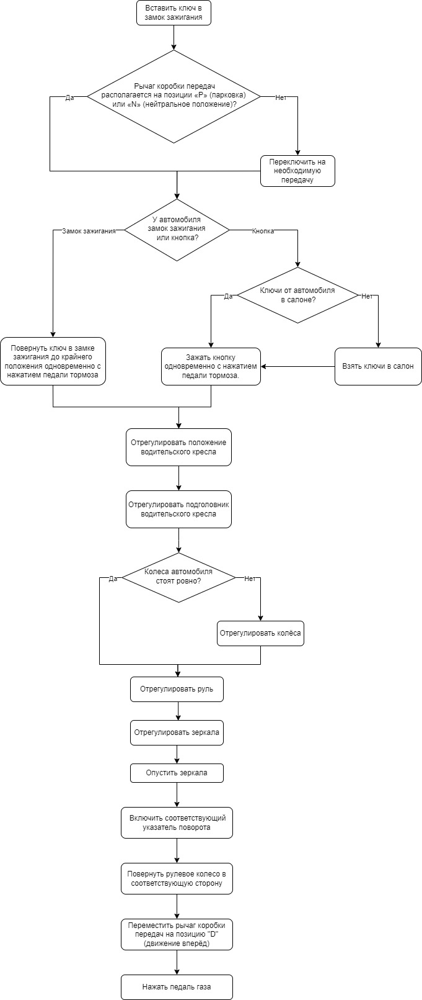
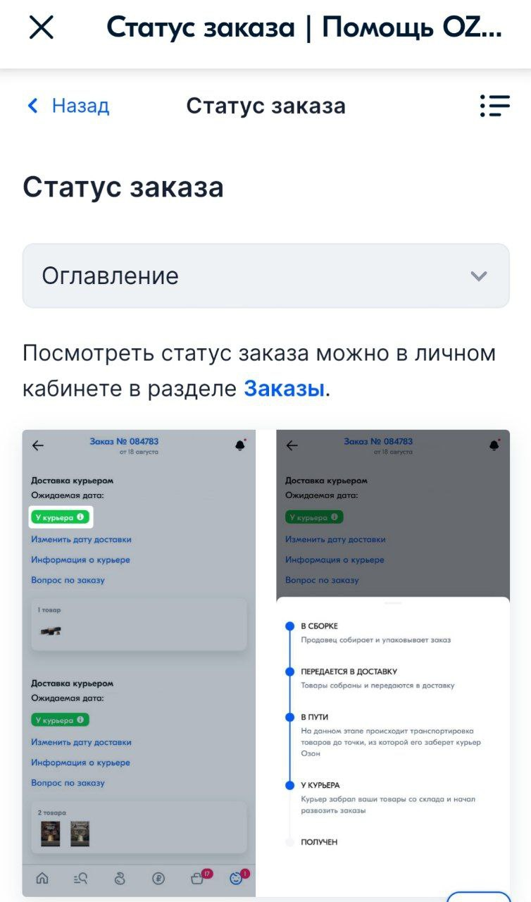
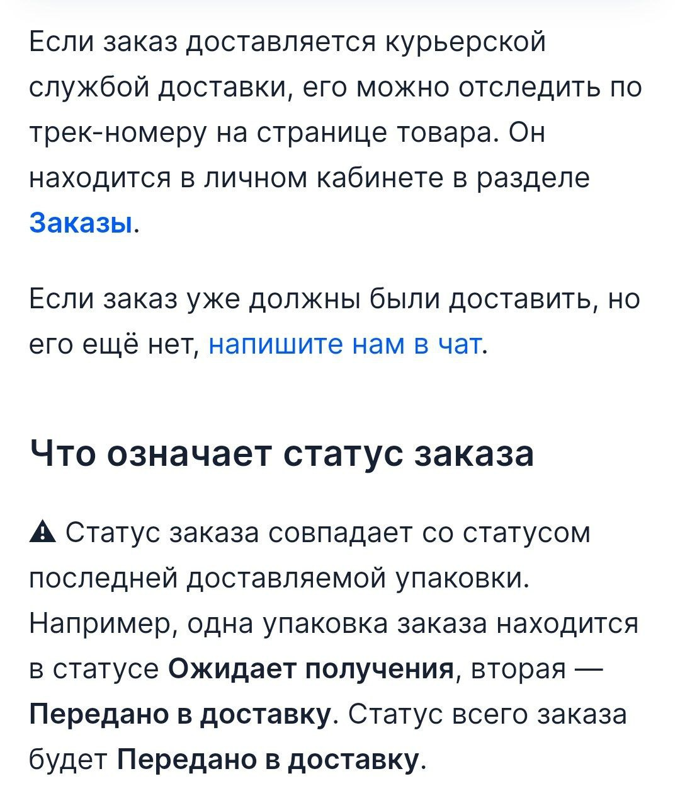
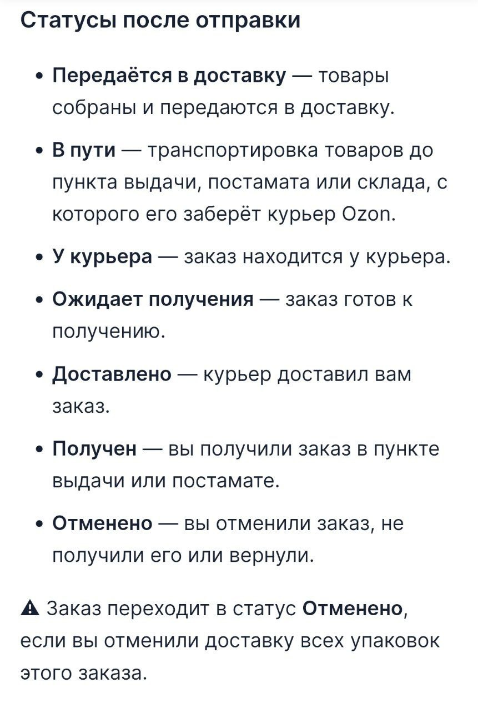

# Стиль

## Как приступить к вождению на автомобиле с автоматической коробкой передач

*После выполнения указанных действий Ваш автомобиль с автоматической коробкой передач будет готова к поездке.*

#### 1. Запуск двигателя
1.1. Вставьте ключ в замок зажигания.
1.2. Убедитесь, что рычаг коробки передач располагается на позиции «P» (парковка) или «N» (нейтральное положение).
1.3. Поверните ключ в замке зажигания до крайнего положения — поворачивайте его по часовой стрелке, пока не услышите два щелчка. Одновременно с этим не забудьте держать педаль тормоза нажатой.

<u>*Примечание: </u>
На некоторых современных автомобилях вместо замка зажигания может быть кнопка. Алгоритм в этом случае схож — зажать кнопку, убедившись, что ключи от автомобиля находятся в салоне.*

*Если Вы выполнили предыдущие шаги правильно, то должны услышать характерный звук работающего двигателя и увидеть поднявшуюся на тахометре стрелку.*
#### 2. Настройка места водителя

*На этом этапе необходимо настроить водительское кресло, рулевое колесо, а также зеркала, чтобы Вам было удобно водить автомобиль*.

**2.1. Настройка сидения**

2.1.1. Отрегулируйте водительское кресло так, чтобы ноги были согнуты при нажатии на педали до упора. Сделать это можно при помощи рычага продольного положения кресла, который располагается спереди под сидением.
2.1.2. Отрегулируйте подголовник водительского кресла так, чтобы согнутые под углом 120 градусов руки доставали до рулевого колеса. Сделать это можно при помощи рычага регулировки уровня сидения, который располагается слева у сидения.

**2.2. Настройка рулевого колеса**

*Перед выполнением этого пункта убедитесь, что колеса автомобиля стоят прямо*.

2.2.1. Отрегулируйте руль так, чтобы соответствовать положению тела из пункта 2.1. При этом рулевое колесо не должно быть слишком высоко или касаться Ваших колен. Сделать это можно при помощи рычага, который располагается под рулевой колонкой.

**2.3. Настройка зеркал**

2.3.1. Отрегулируйте боковые зеркала так, чтобы в них были видны задние колеса автомобиля. Сделать это можно при помощи ручек регулировки зеркал, располагающихся на дверях автомобиля.

2.3.2. Опускайте зеркала, пока не будет видно часть дороги сбоку и сзади автомобиля.

#### 3. Начало движения

*Перед началом движения не забудьте пристегнуть ремень безопасности и убедиться, что все пассажиры пристёгнуты.*

3.1. Включите соответствующий указатель поворота.
3.2. Поверните рулевое колесо в соответствующую сторону.
3.3. Переместите рычаг коробки передач на позицию "D" (движение вперёд). Одновременно с этим удерживайте педаль тормоза.
3.4. Нажмите педаль газа.

*В результате выполнения данных шагов Вы сможете начать движение, предварительно убедившись в правильной регулировке водительского места.*

# Системность мышления

Для создания схемы взаимодействия компонентов я использовал блок—схему в редакторе draw.io:

# Обратная связь

Для ревью я взял статью [«Настройки аккаунта»](https://docs.ozon.ru/common/my—settings/my—account/?country=RU).

##### Мои предложения по исправлениям:

— Раздел «Возможные ошибки и способы их решения». В конце раздела лучше бы добавить ссылку на тех. поддержку — не все пользователи могут самостоятельно разобраться с возникающими ошибками, также могут возникать непредвиденные баги.
Поэтому стоит продублировать ссылку на тех. поддержку из конца статьи — в конец вышеупомянутого раздела добавить фразу: «Не получилось решить проблему? — напишите нам в чат».
 
— Раздел «Регистрация и вход на Ozon через Госуслуги». Упоминание «Регистрация и вход через Госуслуги доступны в тестовом режиме ограниченному количеству пользователей и только в веб—версии» требует уточнения — ничего не сказано, как попасть в упомянутый круг пользователей, нужно ли как—то дополнительно активировать эту опцию, если у пользователя доступен тестовый режим.
Думаю, нужно сделать фразу «тестовом режиме» гиперссылкой, ведущей на статью, где содержатся ответы на возможные вопросы.

# Переводы

За основу я взял раздел «Помощь — Статус заказа»:

<pre>
Order status | Help OZON
<— Back            Order status
<b>Order status</b>
Table of contents
You can check status of the order in the personal
account in the Orders section.
</pre>

<pre>
If the order is delivered by a courier delivery 
service, it can be tracked using the track number 
on the product page. It is located in your 
personal account in the Orders section.

If your order already should have been delivered
but hasn't arrived yet, write to us to the chat.

<b>What does the order status mean?</b>

⚠️ The order status matches the status of the last
package delivered. For example, one package of the order
has the status <b>Awaiting receipt</b>, the second has 
the status <b>Transferred for delivery</b>. The status of the 
entire order will be <b>Transferred for delivery</b>.
 </pre>
 
 <pre>
 <b>Statuses before sending</b>
 
 <b>Created</b> — the order has this status immediately 
 after registration.
 <b>Awaiting payment</b> — the order has been processed, 
 but not paid.
 <b>In assembly</b> — the order being collected
 and packaged.
</pre>
 
  <pre>
 <b>Statuses after sending</b>
 
 <b>Transferred for delivery</b> — goods are collected and 
 being transferred for delivery.
 <b>On the way</b> — transportation of goods to the point 
 of delivery, terminal or stock, from which 
 the Ozon courier will take it.
 <b>With the courier</b> — the order is with the courier.
 <b>Awaiting receipt</b> — the order is ready to be received.
 <b>Delivered</b> — the courier has delivered your order.
 <b>Received</b> — you have received the order 
 at the pick—up point or post office.
 <b>Canceled</b> — you either canceled the order, or did not 
 receive it, or returned it.

 ⚠️ The order changes to <b>Canceled</b> status if you 
 cancel the delivery of all packages of this order.
  </pre>